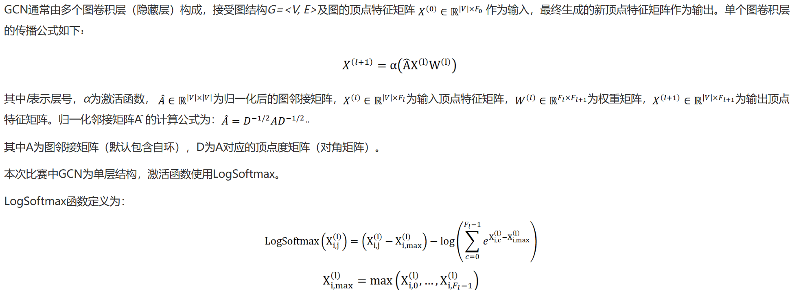
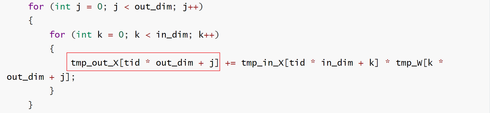
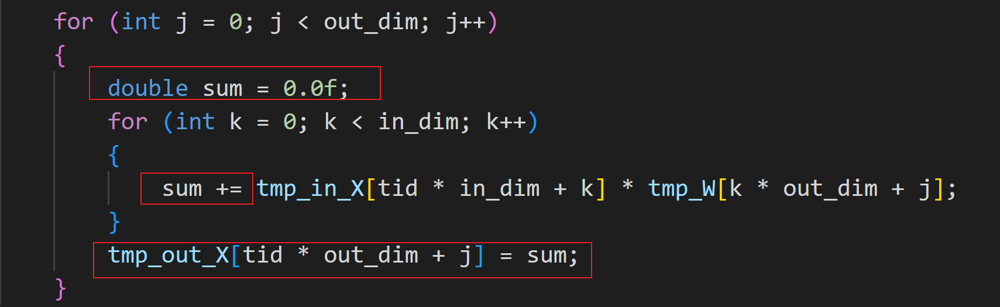
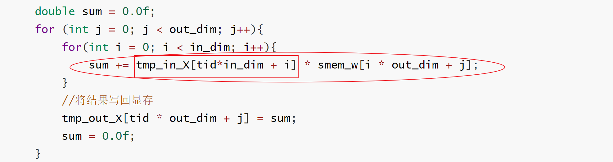
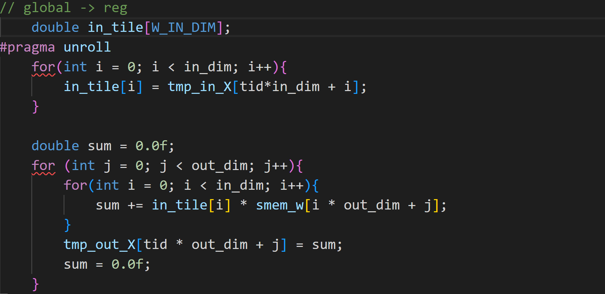
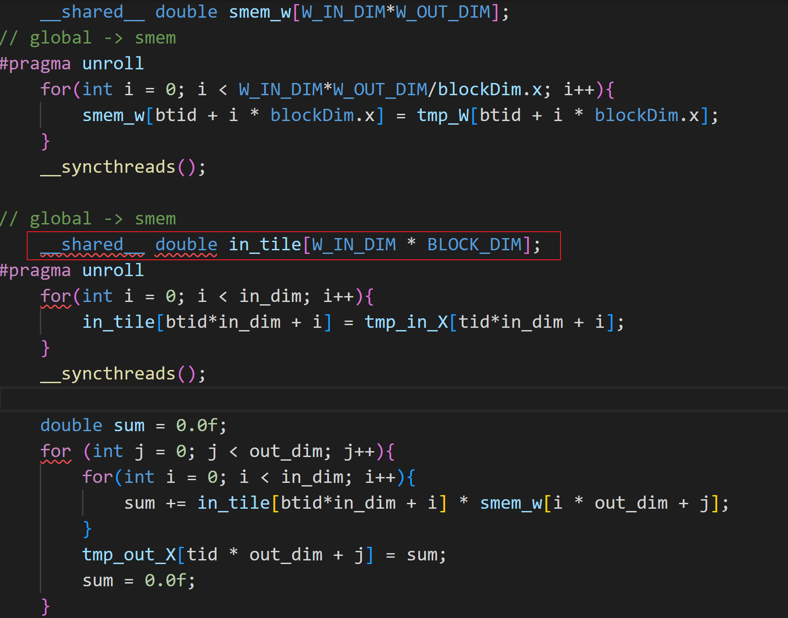
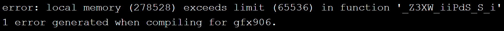
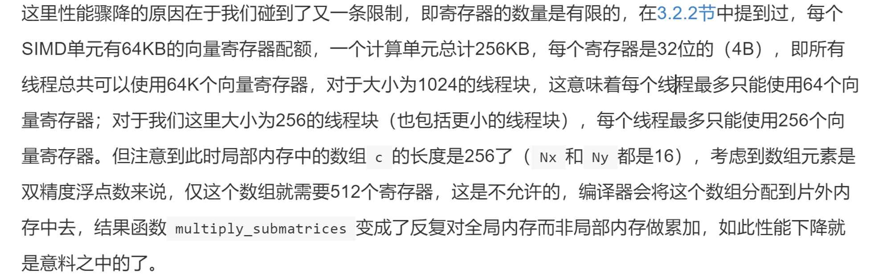

# 先导杯（中南赛区）—**图卷积神经网络推理优化**

官网连接：[先导杯计算应用大奖赛 (sugon.com)](https://cas-pra.sugon.com/detail.html?tournament_id=33)

[TOC]

## 题目



## 解题思路

1. 主要优化三个算子：

   a. 畸形矩阵乘（Mx128）*（128x16）

   b. 稀疏矩阵乘（CSR压缩方式）

   c. LogsoftMax

### 1. 畸形矩阵乘

矩阵大小：
$$
左乘矩阵X：v\_num \times 128
$$

$$
右乘矩阵W：128 \times 16
$$

其中，

1. `v_num >> 128 > 16`（测试数据为v_num=281903）
2. 矩阵均是`行主序`存储的
3. 硬件限制还是啥，线程块（BLOCK）的大小（BLOCK_DIM）好像最大只能设置为**256**

#### 1.1. Baseline

```c++
__global__ void XW_(int in_dim, int out_dim, double *in_X, double *out_X, double *W, int v_num)
{

    int tid = threadIdx.x + blockIdx.x * blockDim.x; // 控制v_vum

    if (tid >= v_num)
        return;

    double *tmp_in_X = in_X;
    double *tmp_out_X = out_X;
    double *tmp_W = W;

    for (int j = 0; j < out_dim; j++)
    {
        for (int k = 0; k < in_dim; k++)
        {
            tmp_out_X[tid * out_dim + j] += tmp_in_X[tid * in_dim + k] * tmp_W[k * out_dim + j];
        }
    }
}
// 耗时 177.190ms
```

**思路：**

1. 每个thread遍历一行`X矩阵`，共需要`v_num`个thread；

2. 外层循环控制`W矩阵`的列号；
3. 内层循环控制K，即内积的维度；

**算法分析：**

核心是这条指令：

`tmp_out_X[tid * out_dim + j] += tmp_in_X[tid * in_dim + k] * tmp_W[k * out_dim + j];`

这条代码由 3条Load指令和1条FMA（乘累加）指令组成，可以计算出计算访存比：

`计算访存比= 1/3`

Baseline过低的计算访存比最终导致了访存延迟不能被隐藏，从而性能不理想。

#### 1.2. 优化1——将对显存重复访问的元素存放到寄存器中

Baseline中的核心计算代码：



由于`tmp_out_x`在内层循环上重复访问显存上的数据，造成显存访问量增加。可以在寄存器上定义临时变量，等到内存循环计算完成之后，在加载写回到显存上，以此减少显存的访问。



**耗时：59ms**

计算访存比：左乘矩阵X访问128x16次，右乘矩阵W访问了128x16次，写回矩阵tmp_out_X访问了16次。FMA共128x16次。那么计算访存比=128x16/（128x16+128x16+16）=0.498

#### 1.3. 优化2——将右乘矩阵W加载到SM中

`右乘矩阵W`，每次都从global memory中读取元素，速度较慢。针对`右乘矩阵W`，可以看到每一个线程都会遍历其所有元素，一个简单的思路为，将`右乘矩阵W`读取到**共享内存（Shared Memory，SM）**中，使得一个线程块（block）中的可以都可以访问它，以提升访存速度。针对`右乘矩阵W`128x16的大小（$128 \times 16 \times 8B / 1024 = 16K$），可以考虑把整个`右乘矩阵W`一次性加在到`Shared Memory`中。

针对左乘矩阵，一个thread读取一行数据，即每个thread需要完成的计算：$1\times128$的向量和$128\times16$ 矩阵相乘。所以，每个Block需要将`右乘矩阵W`读取到SM中，可以减少每个thread从访问显存上`W矩阵`的次数（原先每个thread需要访问显存128x16次，将其加载到SM后，每个thread只需要访问显存8（128x16/BLOCK_DIM）次）。

代码如下：

```c++
__global__ void XW_(int in_dim, int out_dim, double *in_X, double *out_X, double *W, int v_num)
{
    int tid = threadIdx.x + blockIdx.x * blockDim.x; // 控制v_vum
    int btid = threadIdx.x;
    if (tid >= v_num)
        return;

    double *tmp_in_X = in_X;
    double *tmp_out_X = out_X;
    double *tmp_W = W;

    __shared__ double smem_w[W_IN_DIM*W_OUT_DIM];
// global -> smem
#pragma unroll
    for(int i = 0; i < W_IN_DIM*W_OUT_DIM/blockDim.x; i++){
        smem_w[btid + i * blockDim.x] = tmp_W[btid + i * blockDim.x];
    }
    __syncthreads();

    double sum = 0.0f;
    for (int j = 0; j < out_dim; j++){
        for(int i = 0; i < in_dim; i++){
            sum += tmp_in_X[tid*in_dim + i] * smem_w[i * out_dim + j];
        }
        //将结果写回显存
        tmp_out_X[tid * out_dim + j] = sum;
        sum = 0.0f;
    }
}
```

**耗时：15.250ms**

计算访存比（这里的`访存`指的是`访问显存`）：左乘矩阵X访问`128x16`次，右乘矩阵W访问了`8+128x16/10`（8是显存的访问次数，128x16是SM的访问次数，除以10是折算成访问显存的速度）次，写回矩阵tmp_out_X访问了16次。FMA共128x16次。

**计算访存比：（128x16）/（128x16 +（8+128x16/10）+16）= 0.8995**

#### 1.4. 优化3——优化左乘矩阵X的访存

1.3节中计算的核心代码为



上述代码存在两个问题：

1. 可以看到`smem_w`访问的是SM，而`tmp_in_X`访问的是global memory（GM），两者访存速度相差了一个数量级，导致smem_w已经加载到寄存器中了，而tmp_in_x还没传输到寄存器中；只有两者都加载到寄存器中才会执行运算操作。所以如何加快tmp_in_x的访存速度呢？
2. 由于采用的是`内积`的方式：`tmp_in_X[tid*in_dim + i]`内层循环结束之后，开始下一次的内层循环，会发现，两次内层循环`tmp_in_X[tid*in_dim + i]`读取的数据是相同的，即在GM上重复读取了数据，会降低计算访存比。

两个问题的核心就是 将`tmp_in_X[tid*in_dim + i]`从GM中移动到SM中或者是寄存器（reg）中。

##### 1.4.1 优化3.1 （内积法）将左乘矩阵中的一行数据从GM中加载到Regs中



**耗时：11.108ms**

计算访存比（这里的`访存`指的是`访问显存`）：左乘矩阵X访128+128x16/100次（128是显存的访问次数，128x16是寄存器的访问次数，除以100是折算成访问显存的速度），右乘矩阵W访问了8+128x16/10（8是显存的访问次数，128x16是SM的访问次数，除以10是折算成访问显存的速度）次，写回矩阵tmp_out_X访问了16次。FMA共128x16次。1823.36

**计算访存比：（128x16）/（128+128x16/100 +（8+128x16/10）+（16+128x16/100））= 1.123**

##### 1.4.2 优化3.2 （内积法）将左乘矩阵中的一行数据从GM中加载到SM中



编译错误：申请不了这么多SM：128x256x8/1024=256k，一个Block就需要申请256K的共享内存

##### 1.4.3 优化3.3 （外积法）将左乘矩阵中的一行数据只加载一次，直接提升计算访存比

```C++
__global__ void XW_(int in_dim, int out_dim, double *in_X, double *out_X, double *W, int v_num)
{
    int tid = threadIdx.x + blockIdx.x * blockDim.x; // 控制v_vum
    int btid = threadIdx.x;
    if (tid >= v_num)
        return;

    double *tmp_in_X = in_X;
    double *tmp_out_X = out_X;
    double *tmp_W = W;

    __shared__ double smem_w[W_IN_DIM*W_OUT_DIM];
// global -> smem
#pragma unroll
    for(int i = 0; i < W_IN_DIM*W_OUT_DIM/blockDim.x; i++){
        smem_w[btid + i * blockDim.x] = tmp_W[btid + i * blockDim.x];
    }
    __syncthreads();

    double in_e;
    double out[W_OUT_DIM];
// init
#pragma unroll
    for(int i = 0; i < W_OUT_DIM; i++){
        out[i] = 0.0f;
    }

//compute
    for(int i = 0; i < in_dim; i++){
        in_e = tmp_in_X[tid*in_dim + i];
        for (int j = 0; j < out_dim; j++){
            out[j] +=  in_e * smem_w[i * out_dim + j];
        }
    }

// reg -> global
#pragma unroll
    for(int i = 0; i < W_OUT_DIM; i++){
        tmp_out_X[tid * out_dim + i] = out[i];
    }
}
```

**耗时：10.287ms**

使用矩阵外积的算法：每次从`左乘矩阵X`读取tid行中的第`i`元素，分别与`右乘矩阵W`的第`i`行的每个元素相乘，得到长度为16（右乘矩阵的列数）的一维向量，重复上述过程，并一维向量进行累加操作，得到最后的结果。

计算访存比（这里的`访存`指的是`访问显存`）：左乘矩阵X访**128+128x16/100**（128是显存的访问次数，128x16是寄存器的访问次数，除以100是折算成访问显存的速度），右乘矩阵W访问了**8+128x16/10**（8是显存的访问次数，128x16是SM的访问次数，除以10是折算成访问显存的速度）次，写回矩阵tmp_out_X访问了**16+128x16/100**（16是显存的访问次数，128x16是寄存器的访问次数，除以100是折算成访问显存的速度）次。FMA共128x16次。

**计算访存比：（128x16）/（128+128x16/100 +（8+128x16/10）+（16+128x16/100））= 1.123**

可以看到`优化3.1 内积法`和`优化3.3 外积法`具有相同计算访存比，但是外积法耗时更短（内积法11.108ms，外积法10.287ms）。

***以下是我个人的分析，感觉有些问题：***

可以看到优化3.1中，申请长为128（左乘矩阵的列数）的双精度数组：`double in_tile[W_IN_DIM];`而优化3.3中，申请了一个长度为16（右乘矩阵的列数）的双精度数组：`double out[W_OUT_DIM];`但是每个线程能被分到的寄存器的数量是有限的：



即一个SIMD单元（CUDA中对应的应该是**SM（streaming multiprocessor）**）最多可以使用64K寄存器，那么每个thread（BLOCK_DIM=32）可以使用256个32位的寄存器，而`128维的双精度数组`就需要256个32位的寄存器了，加上其他的运算操作，寄存器肯定不够用了。并且一个thread使用的寄存器越多，其occupancy就越低。所以减少寄存器的使用可以进一步提升运算效率。

#### 1.5 优化4——减少寄存器的使用和提升访存速度

**优化3.1 （内积法）将左乘矩阵中的一行数据从GM中加载到Regs中** 可以减少寄存器的使用吗？

可以借鉴**优化3.3中的外积法**，从`左乘矩阵X`中读取一个元素，然后完成这个元素的所有计算，然后使用相同的寄存器来存放下一个元素。

本方法一次从`左乘矩阵X`取`K_TILE`个元素存放在数组中，这`K_TILE`个元素和`右乘矩阵W`的`K_TILEx16`进行内积计算，得到一个16（W的列数）维的中间向量。循环`K/K_TILE`次，累加中间变量得到最终结果。

```C++
__global__ void XW_(int in_dim, int out_dim, double *in_X, double *out_X, double *W, int v_num)
{
    int tid = threadIdx.x + blockIdx.x * blockDim.x; // 控制v_vum
    int btid = threadIdx.x;
    if (tid >= v_num)
        return;
    
    double in_tile[K_TILE]; // K_TILE 16
    double out_tile[W_OUT_DIM];

#pragma unroll
    for (int i = 0; i < out_dim; ++i) {
        out_tile[i] = 0.0f;
    }

    double *tmp_in_X = in_X;
    double *tmp_out_X = out_X;
    double *tmp_W = W;

    __shared__ double smem_w[W_IN_DIM*W_OUT_DIM];
// global -> smem
#pragma unroll
    for(int i = 0; i < W_IN_DIM*W_OUT_DIM/blockDim.x; i++){
        smem_w[btid + i * blockDim.x] = tmp_W[btid + i * blockDim.x];
    }
    __syncthreads();

    for(int i = 0; i < in_dim/K_TILE; i++){       
        //load K_TILE elem to reg from global memory
        for(int j = 0; j < K_TILE; j++){
            in_tile[j] = tmp_in_X[tid * in_dim + i*K_TILE + j];
        }
        
        // compute
        for (int j = 0; j < out_dim; j++){
            for (int k = 0; k < K_TILE; k++)
                out_tile[j] += in_tile[k] * smem_w[(i*K_TILE+ k) * out_dim + j];
        }
    }

    // store
    for(int i = 0; i < out_dim; i++){
        tmp_out_X[tid * out_dim + i] = out_tile[i];
    }
}
```

**耗时：1.139ms**

可以看到这版优化相对优化3.1和优化3.3均获得了巨大提升。（有个超参K_TILE，最优的结果是16），这么做带来了如下好处：

**相对于优化3.1版本：**

1. 减少了寄存器的使用（3.1版本申请了128维数组，4版本申请了32维数组），提升了occupancy；
2. 将最终的计算结果写回global memory，由于额外申请了out_tile数组，集中将数组写回global memory，可以利用cache，提高了吞吐量和访存速度。

**相对于优化3.3版本：**

1. 优化3.3版本中一次只读取一个元素，而优化4版本中一次读取`K_TILE`中，可以利用cache，提升吞吐量。

   

**这里不知道是 提升occupancy带来的提升大，还是提升吞吐量带来的提升大？**

#### 1.6 优化5——向量化访存（运行时间反而上升了）

代码：

```c++
//double4版本
__global__ void XW_(int in_dim, int out_dim, double *in_X, double *out_X, double *W, int v_num)
{
    int tid = threadIdx.x + blockIdx.x * blockDim.x; // 控制v_vum
    int btid = threadIdx.x;
    if (tid >= v_num)
        return;
    //向量化读取
    double4 in_tile[K_TILE/4];
    double4 out_tile[W_OUT_DIM/4];

#pragma unroll
    for (int i = 0; i < W_OUT_DIM/4; ++i) {
        out_tile[i] = {0.0f, 0.0f, 0.0f, 0.0f};
    }

    double *tmp_in_X = in_X;
    double *tmp_out_X = out_X;
    double *tmp_W = W;

    __shared__ double smem_w[W_IN_DIM*W_OUT_DIM];
// global -> smem
#pragma unroll
    for(int i = 0; i < W_IN_DIM*W_OUT_DIM/blockDim.x; i++){
        smem_w[btid + i * blockDim.x] = tmp_W[btid + i * blockDim.x];
    }
    __syncthreads();

    for(int i = 0; i < in_dim/K_TILE; i++){       
        //load K_TILE elem to reg from global memory
        for(int j = 0; j < K_TILE/4; j++){
            double4 tmp_in4 = reinterpret_cast<double4*>(tmp_in_X)[tid * in_dim / 4 + i*K_TILE / 4 + j]; 
            in_tile[j].x = tmp_in4.x;
            in_tile[j].y = tmp_in4.y;
            in_tile[j].z = tmp_in4.z;
            in_tile[j].w = tmp_in4.w;
        }
        
        // compute
        for (int j = 0; j < W_OUT_DIM/4; j++){
            for (int k = 0; k < K_TILE/4; k++)
            {   
                out_tile[j].x += in_tile[k].x*smem_w[(i*K_TILE+k*4+0)*out_dim+j*4+0];
                out_tile[j].x += in_tile[k].y*smem_w[(i*K_TILE+k*4+1)*out_dim+j*4+0];
                out_tile[j].x += in_tile[k].z*smem_w[(i*K_TILE+k*4+2)*out_dim+j*4+0];
                out_tile[j].x += in_tile[k].w*smem_w[(i*K_TILE+k*4+3)*out_dim+j*4+0];
				
                out_tile[j].y += in_tile[k].x*smem_w[(i*K_TILE+k*4+0)*out_dim+j*4+1];
                out_tile[j].y += in_tile[k].y*smem_w[(i*K_TILE+k*4+1)*out_dim+j*4+1];
                out_tile[j].y += in_tile[k].z*smem_w[(i*K_TILE+k*4+2)*out_dim+j*4+1];
                out_tile[j].y += in_tile[k].w*smem_w[(i*K_TILE+k*4+3)*out_dim+j*4+1];
                
              	out_tile[j].z += in_tile[k].x*smem_w[(i*K_TILE+k*4+0)*out_dim+j*4+2];
                out_tile[j].z += in_tile[k].y*smem_w[(i*K_TILE+k*4+1)*out_dim+j*4+2];
                out_tile[j].z += in_tile[k].z*smem_w[(i*K_TILE+k*4+2)*out_dim+j*4+2];
                out_tile[j].z += in_tile[k].w*smem_w[(i*K_TILE+k*4+3)*out_dim+j*4+2];
                
				out_tile[j].w += in_tile[k].x*smem_w[(i*K_TILE+k*4+0)*out_dim+j*4+3];
                out_tile[j].w += in_tile[k].y*smem_w[(i*K_TILE+k*4+1)*out_dim+j*4+3];
                out_tile[j].w += in_tile[k].z*smem_w[(i*K_TILE+k*4+2)*out_dim+j*4+3];
                out_tile[j].w += in_tile[k].w*smem_w[(i*K_TILE+k*4+3)*out_dim+j*4+3];
            }
        }
    }

    // store
    for(int i = 0; i < out_dim/4; i++){
        // tmp_out_X[tid * out_dim + i] = out_tile[i];
        reinterpret_cast<double4*>(tmp_out_X)[tid * out_dim/4 + i] = out_tile[i];
    }
}
```

**耗时：3.009ms**

这里的时间反而上升了，很奇怪。。。

**double2版本耗时为3.187ms**

### 2. 稀疏矩阵乘


### 3. LogsoftMax